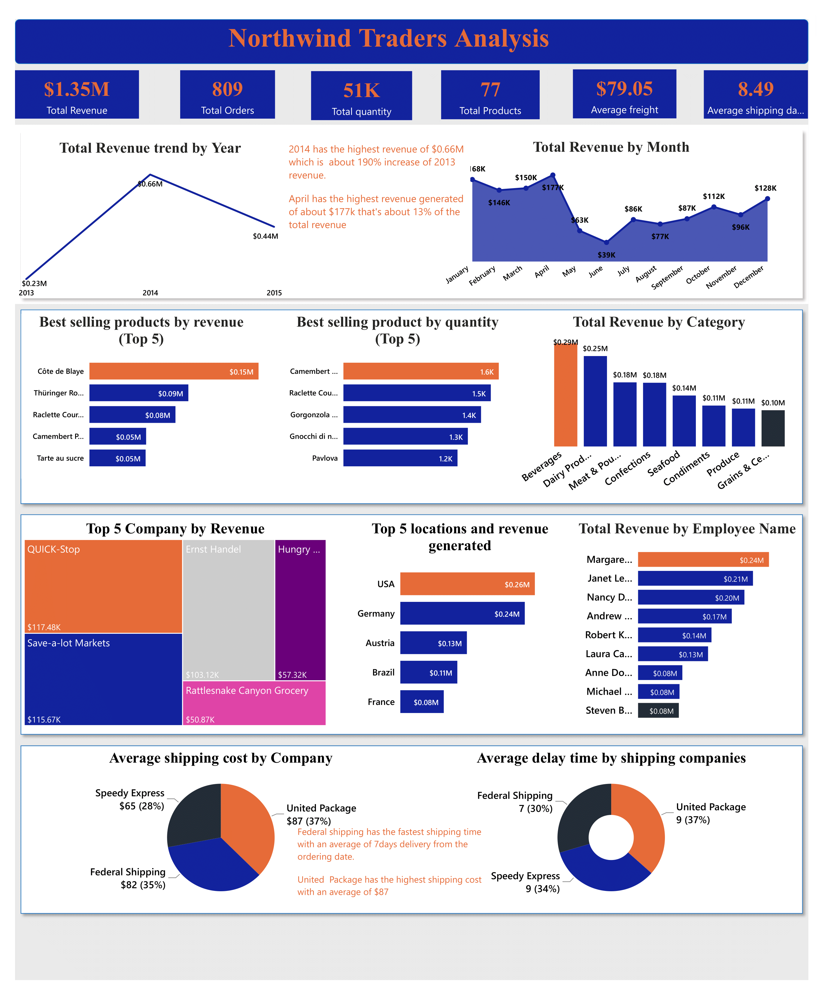

# Northwind-Traders-Analysis
I built a top-level KPI dashboard for the executive team using Power BI.
As a business and data analyst, I analyzed sales and others for Northwind Traders, a fictitious gourmet food supplier, 
including information on customers, products, order, shippers and employees.

## Purpose is to quickly analysed the company's performance in key areas including;
- Sales trends
- Product performance
- Key customers
- Shipping costs

## The processes I took in other to generate insights for the key areas above are:
- Cleaned the data using power query. Replaced blanks cells with 0 and checked for duplicates.
- Added extra columns to calculate the average shipping duration
- Created Relationships: Data modelling to connect the 7 tables together using many-to-one and one-to-many relationships
- Created the report in Power BI desktop and visualized with charts.
- Designed my dashboard with reports and important metrics

